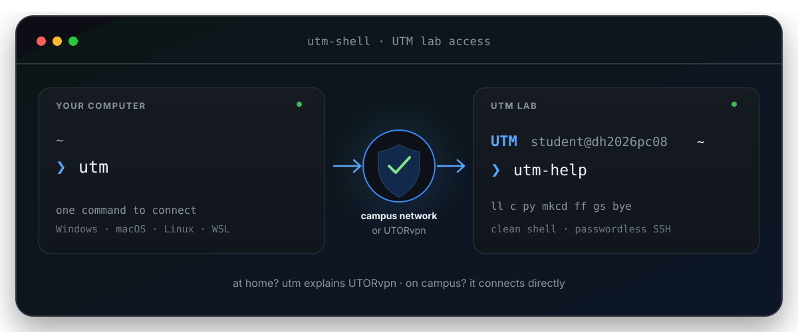

<div align="center">
  

# utm-shell

**Easy UTM lab SSH setup for Windows, macOS, Linux, WSL, ChromeOS Linux, and other Unix-like systems.**

[](https://github.com/andrewmuratov/utm-shell/actions/workflows/validate.yml)
[](LICENSE)
[](docs/platforms.md#windows-10--11)
[](docs/platforms.md#macos)
[](docs/platforms.md#linux)

**No GitHub account required. No shell framework. No remote sudo.**

After setup, connecting is simply:

```text
ssh utm
```

</div>

---

## Start here — about 2 minutes

You only need:

1. your **UTORid**
2. a real UTM lab hostname, for example `dh2026pc08`
3. either **campus Wi-Fi** or **UTORvpn**

> If you have never used SSH before, use the step-by-step **[Getting Started guide](GETTING_STARTED.md)**. It assumes no prior terminal knowledge.

### Windows 10 / 11

Open **PowerShell** or **Windows Terminal → PowerShell**, then paste:

```powershell
$installer = "$env:TEMP\utm-shell-install.ps1"
Invoke-WebRequest https://raw.githubusercontent.com/andrewmuratov/utm-shell/main/install.ps1 -OutFile $installer
& $installer
```

No WSL, Git Bash, or Cygwin is required.

### macOS / Linux / WSL / ChromeOS Linux

Open a terminal and paste:

```bash
bash <(curl -fsSL https://raw.githubusercontent.com/andrewmuratov/utm-shell/main/install.sh)
```

The installer asks for your UTORid and lab hostname, then walks you through the rest.

Your UTORid password may be requested **once** while your public SSH key is added to your UTM account. The project never reads or stores that password.

When setup finishes:

```text
ssh utm
```

You should get a prompt like:

```text
UTM yourutorid@dh2026pc08 ~
❯
```

### Prefer not to run a downloaded script directly?

Download or clone the repository, inspect the script, and run it locally:

```bash
git clone https://github.com/andrewmuratov/utm-shell.git
cd utm-shell
./install.sh
```

On Windows PowerShell:

```powershell
git clone https://github.com/andrewmuratov/utm-shell.git
cd utm-shell
.\install.ps1
```

You can also use GitHub's **Code → Download ZIP** button if you do not have Git installed.

## What it does

### On your computer

- creates a managed `Host utm` entry in your OpenSSH config
- remembers your UTORid and selected lab hostname
- sets up secure public-key authentication
- reuses an existing Ed25519 key or creates a dedicated UTM key
- keeps idle SSH sessions alive
- supports `ssh` and `scp` on all major desktop platforms
- uses Unix connection multiplexing where supported
- avoids Unix-only options in native Windows OpenSSH

### On the UTM machine

- adds a clearly marked and removable block to `~/.bashrc`
- gives the shell a clean blue `UTM` prompt
- works around unsupported modern terminal types when necessary
- improves Bash history and Up/Down history search
- adds a small set of useful commands
- hides the large Ubuntu login message unless you opt out

It does **not** replace the university shell, install a framework, disable SSH host verification, overwrite unrelated dotfiles, upload a private key, or require root access on UTM.

## Platform support

| Your computer | Setup | SSH | SCP | Key login | X11 GUI forwarding |
|---|---|---:|---:|---:|---:|
| **Windows 10/11** | PowerShell | ✓ | ✓ | ✓ | ✓ with an X server |
| **macOS** | Bash | ✓ | ✓ | ✓ | ✓ with XQuartz |
| **Linux** | Bash | ✓ | ✓ | ✓ | ✓ |
| **WSL** | Bash | ✓ | ✓ | ✓ | ✓ with WSLg/X |
| **ChromeOS Linux** | Bash | ✓ | ✓ | ✓ | environment-dependent |
| **BSD / other Unix** | Bash | ✓* | ✓* | ✓* | platform-dependent |

`*` Requires Bash and a modern OpenSSH client.

Detailed platform instructions: **[docs/platforms.md](docs/platforms.md)**

## If login says `Permission denied`

A correct password does **not always mean the problem is on your computer**. If the lab host is reachable but both password login and key setup fail, your UTORid may not yet be provisioned on the lab system, or there may be a server-side account issue.

Do not keep changing SSH settings blindly and do not post your password anywhere.

Use the diagnostics first:

```bash
./doctor.sh
```

or on Windows:

```powershell
.\doctor.ps1
```

Then see **[Login problems](docs/login-problems.md)** for a short decision tree. If it points to an account-side problem, contact course staff or the lab/system administrator with your **UTORid and the hostname you tried**, but never your password or private key.

## Useful commands inside UTM

| Command | What it does |
|---|---|
| `ll` | detailed listing including hidden files |
| `la` | list hidden files |
| `..`, `...`, `....` | move up directories |
| `c`, `cls` | clear the terminal |
| `reload` | reload `~/.bashrc` |
| `mkcd DIR` | create a directory and enter it |
| `ff NAME` | find files/directories below the current directory |
| `disk` | show filesystem disk usage |
| `usage` | show sizes in the current directory |
| `path` | print `$PATH` one entry per line |
| `py` | run `python3` |
| `gs`, `gd`, `gl` | compact Git shortcuts |
| `utm-help` | show the command reference |

Type the beginning of an old command and press **↑/↓** to search matching history.

## Copy files

The same `scp` commands work from macOS, Linux, WSL, and native Windows OpenSSH.

```bash
# your computer → UTM
scp exercise.py utm:~/exercise.py

# UTM → your computer
scp utm:~/result.txt ./result.txt

# whole directory
scp -r lab01 utm:~/labs/
```

## Graphical apps / X11

For trusted X11 forwarding:

```bash
ssh -Y utm
```

- **Linux:** normally uses the existing X11/XWayland environment
- **macOS:** use XQuartz
- **Windows:** use an X server such as MobaXterm, VcXsrv, or Xming
- **WSL:** WSLg can provide the graphical side on supported systems

See **[docs/platforms.md](docs/platforms.md)** for details.

## Diagnostics

macOS / Linux / WSL / ChromeOS Linux:

```bash
./doctor.sh
```

Windows PowerShell:

```powershell
.\doctor.ps1
```

The doctor checks OpenSSH, config, alias resolution, network reachability, and key authentication without modifying your setup.

## Uninstall

macOS / Linux / WSL:

```bash
bash <(curl -fsSL https://raw.githubusercontent.com/andrewmuratov/utm-shell/main/uninstall.sh)
```

Windows PowerShell:

```powershell
$uninstaller = "$env:TEMP\utm-shell-uninstall.ps1"
Invoke-WebRequest https://raw.githubusercontent.com/andrewmuratov/utm-shell/main/uninstall.ps1 -OutFile $uninstaller
& $uninstaller
```

The uninstaller removes only `utm-shell`-managed configuration. A dedicated private key is intentionally left on your computer so key deletion is always explicit.

## Security

- SSH host verification stays enabled
- only your **public** key is copied to UTM
- private keys never leave your computer
- UTORid passwords are handled directly by OpenSSH
- existing dotfiles are preserved outside marked blocks
- rerunning setup replaces its own configuration instead of duplicating it
- no analytics, telemetry, daemon, or background service

Windows may require administrator privileges only to enable Microsoft's optional OpenSSH Client feature if it is missing. `utm-shell` itself does not silently elevate.

See **[SECURITY.md](SECURITY.md)**.

## Help

- **New to SSH?** [Getting Started](GETTING_STARTED.md)
- **Login failing?** [Login problems](docs/login-problems.md)
- **Windows/macOS/Linux details?** [Platform guide](docs/platforms.md)
- **General troubleshooting?** [Troubleshooting guide](docs/troubleshooting.md)
- **Project support policy?** [SUPPORT.md](SUPPORT.md)

When reporting a problem publicly, never include your password, private key, authentication token, or other credentials.

## Scope

This is a personal convenience project for University of Toronto Mississauga lab access. It is **not affiliated with, endorsed by, or maintained by the University of Toronto**. Official course and U of T IT instructions take precedence if infrastructure or policy changes.

## License

[MIT](LICENSE) © 2026 Andrew Muratov
